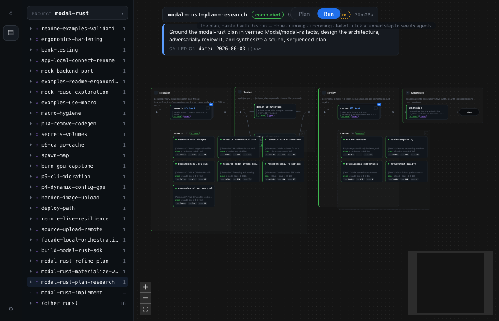
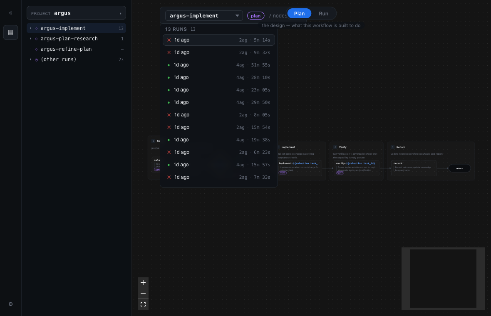
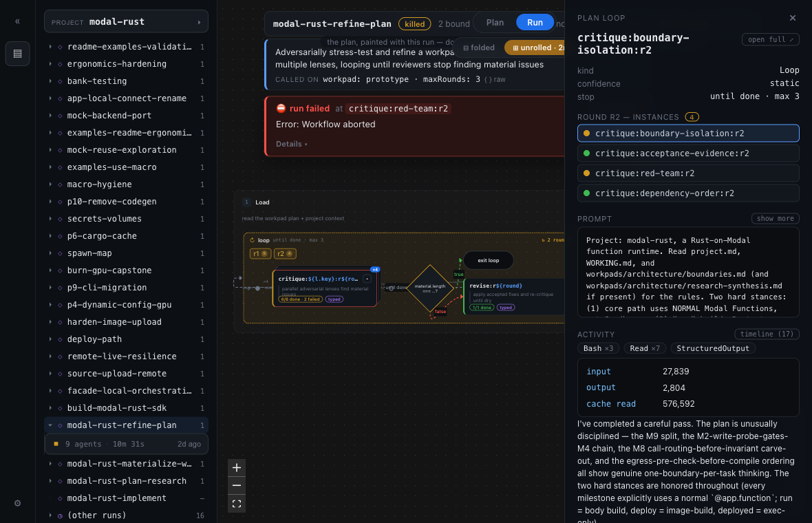
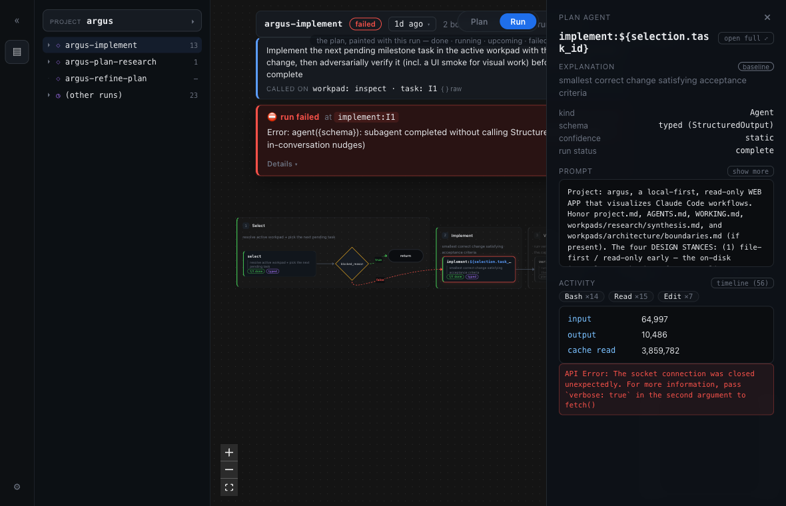
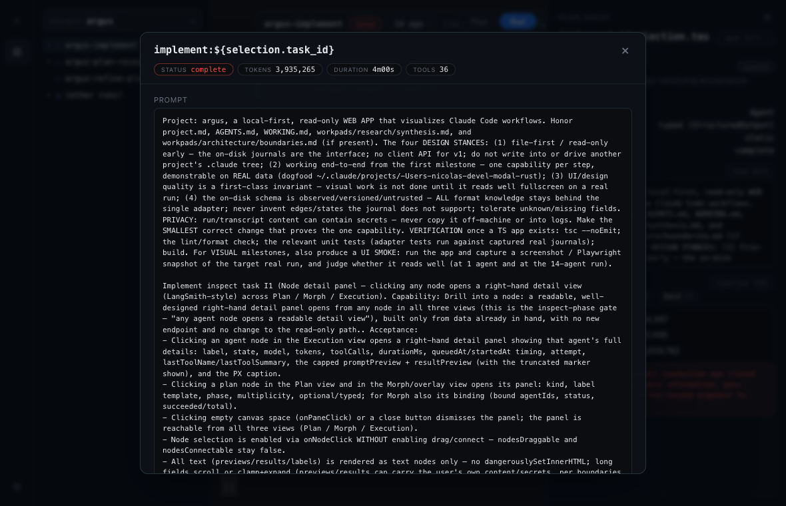

# argus

A local-first, read-only web app for **visualizing Claude Code workflow runs** —
the multi-agent runs produced by the `Workflow` tool. argus reads the run journals
Claude Code already writes under `~/.claude/projects/` and turns them into a
fullscreen graph of phases, agents, tokens, tools, and results.

> Argus Panoptes — the many-eyed watcher. One surface to see everything a workflow
> is doing at once.

> [!WARNING]
> **Work in progress.** argus is an early build. It reads real Claude Code workflow
> run journals end-to-end and renders them, but both the UI and the undocumented
> on-disk format it observes are still moving — not yet stable to build on.



<p align="center">
  
  
</p>

## Status

Early build, end-to-end and on real data at every step. What actually works today:

- **Research gate — passed.** Decisions locked in
  [`workpads/research/synthesis.md`](./workpads/research/synthesis.md) (client
  availability, file-first connection strategy, the hardened on-disk contract, the
  graph-viz library, and the TypeScript stack).
- **Architecture gate — passed.** Contracts ratified in
  [`workpads/architecture/boundaries.md`](./workpads/architecture/boundaries.md)
  (the adapter, the normalized run model, the server↔client API, the live path, the
  render/layout pipeline, the shell, failure modes, and format-version policy).
- **Prototype gate — passed.** The web app renders real runs on a fullscreen
  `@xyflow/react` canvas (left→right phase lanes) in **two views**, switchable from a
  top toggle:
  - **Plan** — the workflow's *intended* DAG, parsed from its `.js` with an acorn AST
    walk: fan-out/merge, decision diamonds, loop containers, `×N` multiplicity (the
    "review-the-workflow" mode; renders run-free).
  - **Run** — a selected run painted onto that same plan template (`7/7 done`, ghosted
    not-run steps, partial/failure chips), where any fanned step **expands in place**
    into its actual agent instances (state, tokens, tools, duration, result). The
    expand replaced the old separate *Progress* + *Execution* tabs — the aggregate↔
    instance join is now a click, not a tab-switch.
  - **Claude captions** — every node gets a one-line plain-language explanation from
    headless `claude -p`, content-addressed-cached + generated in the background.
  - A **collapsible left icon-rail** (VS Code–style tree: project ▸ workflow ▸ runs)
    switches between any discovered project and any of its runs; Plan and Run share one
    unified card + lane visual language.

**Now usable:** `npm run dev`, open `http://localhost:5173`, toggle **Plan / Run**, and
use the left rail to pick any project / run.

See [`project.md`](./project.md) for the product vision and the four design stances,
[`TASKS.md`](./TASKS.md) for the active phase, and [`workpads/`](./workpads/) for the
per-phase work.

## A look around

Real runs from this project and its sibling `modal-rust` (argus dogfoods on the very
workflows it visualizes).

**A failed run says why, where, and when.** A failure banner names the failing step, the
error, and the elapsed-to-failure; the failing step is ringed red instead of reading as a
clean "done"; clicking it drills into the agent's prompt + activity timeline — here, the API
socket-close that actually killed the run (the root cause behind a generic "didn't finalize").



**Read any agent end to end.** "Open full" turns the detail panel into a transcript reader:
the verbatim prompt, the ordered tool timeline, and the readable result, top to bottom.



## How it works

Claude Code writes every workflow run to
`~/.claude/projects/<project-slug>/<session-id>/`. argus reads those journals
directly — **file-first, zero-instrumentation, read-only**. No Claude client API, no
reverse-engineered binary, no leaked source: the observable on-disk files *are* the
interface for the read path.

- A **finished** run renders from its finalized `workflows/wf_<id>.json` (the full
  phase/agent progress tree, result, logs, and timing in one file).
- A **running** run renders from the live journal stream (`subagents/workflows/wf_<id>/journal.jsonl`
  plus per-agent `agent-*.jsonl`), reconciled to `wf_<id>.json` when the run
  finalizes. (Live updates are a later phase — see the `live` workpad.)

The on-disk format is undocumented, unversioned, and treated as untrusted: all
schema knowledge is isolated behind one adapter so a format change is a one-file fix.

## Architecture

An npm-workspaces monorepo of **exactly four packages**, with a strict acyclic
dependency direction (`web → contract`; `server → adapter → contract`):

| Package | Role |
| --- | --- |
| `packages/contract` | Wire types + zod schemas shared by server and web. No internal deps. |
| `packages/adapter` | The **only** format-aware module. Parses `wf_*.json` / journals / `.claude/workflows/*.js` `meta` into the normalized run model. Talks to disk only through an injected `FileSystemPort`. |
| `apps/server` | Node backend. Owns filesystem access, the node `FileSystemPort` impl, file-watching, security, and the HTTP+SSE API. |
| `apps/web` | React 19 + Vite + `@xyflow/react` (React Flow) UI. Sees only `contract` types over the wire — never the adapter or `node:*`. |

**The one invariant:** all knowledge of the raw on-disk format lives in
`packages/adapter` and nowhere else. The web app never sees a raw format, only the
normalized run model over the wire. Read-only in v1 (no writes into any `.claude`
tree); live updates, node inspection, and interact are later phases. Full contracts
are in [`workpads/architecture/boundaries.md`](./workpads/architecture/boundaries.md).

The local backend exists because a browser cannot read the local `~/.claude` tree on
its own. Because it serves filesystem contents on localhost, its security posture is
mandatory: it **binds `127.0.0.1` only**, enforces a `Host`/`Origin` allowlist
(defeating DNS rebinding independent of CORS), and requires a **per-launch bearer
token** on all `/api` and `/stream` routes (checked before any filesystem access).

## Develop

Requires **Node >= 24**. Commands below are the real scripts from `package.json`.

```sh
npm install
```

Run the backend and the frontend in two terminals:

```sh
npm run dev:server   # Node backend on http://127.0.0.1:4317; prints ARGUS_TOKEN on launch
npm run dev:web      # Vite dev server on http://localhost:5173
```

The Vite dev server proxies `/api`, `/health`, and `/stream` to the backend, so the
browser only ever talks to the Vite origin (which keeps the server's Host/Origin
allowlist satisfied with no browser CORS surface). The backend prints an
`ARGUS_TOKEN` on startup (override the port with `ARGUS_PORT`, the token with
`ARGUS_TOKEN`).

### Try it

The simplest entry point is the single launcher, which starts both servers with a
shared per-launch token wired through the Vite proxy:

```sh
npm run dev          # starts the backend + the web app together
```

Then open **http://localhost:5173**. The app opens on the richest discovered run in the
**Run** view. Use the **left icon-rail** (a VS Code–style tree, open by default) to
switch between any discovered project, pick any of its runs, or open the **Plan** view
of a declared workflow. argus reads only your own local `~/.claude` tree and never
writes to it.

Gate commands (kept green every milestone):

```sh
npm run typecheck    # tsc --noEmit across the workspace
npm run lint         # eslint
npm test             # vitest run
npm run build        # vite build of @argus/web
```

## How this repo works

argus is built with a file-backed **workpads** methodology: progress lives in files
and git, one capability is validated per phase, and the work is driven by multi-agent
[`.claude/workflows/`](./.claude/workflows/) (plan-research, refine-plan, implement).
The operating manual is [`AGENTS.md`](./AGENTS.md), the loop is
[`WORKING.md`](./WORKING.md), the active phase is chosen in [`TASKS.md`](./TASKS.md),
and the per-phase work lives under [`workpads/`](./workpads/).

Fittingly, argus's own workflow runs are its first dataset. Captured sample runs used
to build and test the adapter live under the gitignored `.argus/fixtures/` (run
content can carry secrets a workflow touched, so it is never committed and never
copied off-machine).
